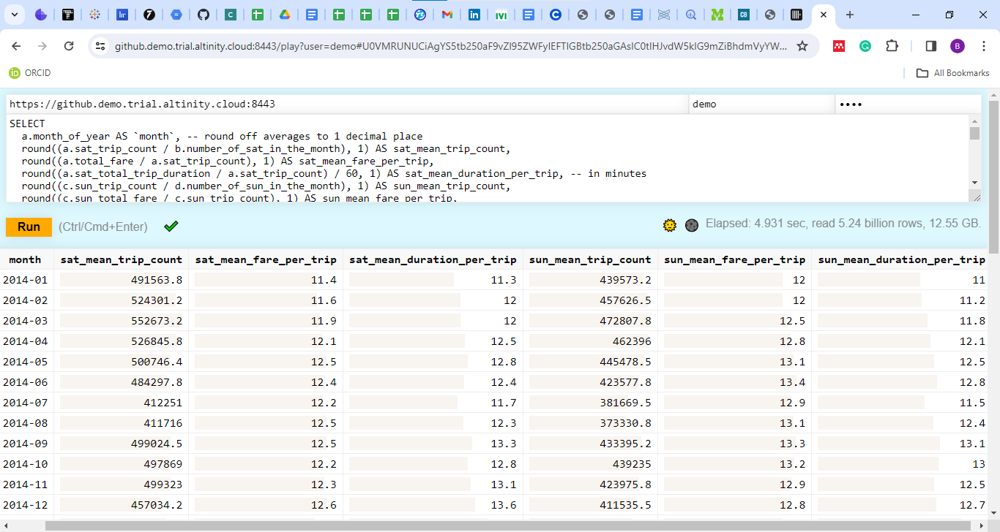

# An End-To-End Data Engineering Project

## Introduction

This documentation covers how I approached the two questions in the take-home test for a data engineering position I applied for. The instructions to complete the test can be found [here](/Instructions_(1).docx)

## Question 1
The first question was to write a query that fetched the following monthly metrics from the New York City taxi trip dataset which is stored in a [Clickhouse database accessible here](https://github.demo.trial.altinity.cloud:8443/play):

- The average number of trips on Saturdays
- The average fare (fare_amount) per trip on Saturdays
- The average duration per trip on Saturdays
- The average number of trips on Sundays
- The average fare (fare_amount) per trip on Sundays
- The average duration per trip on Sundays

The interval of interest was 1st January 2014 and 31st December 2016.

### Understanding the dataset

First, I inspected the `tripdata` table (the table of interest) to see the number of columns it contains and the data types of each column using the `DESCRIBE TABLE` syntax:

```
DESCRIBE TABLE tripdata;
```

Then I got a general sense of the data in the table by selecting the first several rows in the table. I could afford to do a `SELECT *` since there are only 26 columns in the table, which I learned when I ran the previous query. This was also useful as it enabled me to know how the `pickup_date` column was formatted.

```
SELECT * 
FROM tripdata
LIMIT 10;
```

After this, I wanted to know how many rows of data are in the table from 1st January 2014 to 31st December 2016 using:

```
SELECT 
  COUNT(*) AS num_of_rows
FROM tripdata
WHERE pickup_date BETWEEN '2014-01-01' AND '2016-12-31';
```

This returned a whooping 442.39 millions!!! Curious me wanted to find out how many rows the table had in total, so I removed the `WHERE` clause in the previous query, and soon found out that the monstrous number - 1.31 billions.

Since the columns, `pickup_date`, `pickup_datetime`, `dropoff_datetime`, and `fare_amount` will be useful in solving this question, I wanted to know if these columns contained missing values, which could affect the accuracy of the monthly metrics. Therefore, I ran the following query and replaced `pickup_date` with the names of the other three columns in subsequent queries. In all cases, there were no missing data in these columns.

```
SELECT 
  COUNT(*) AS num_of_rows
FROM tripdata
WHERE pickup_date IS NULL;
```

### Finding the average number of trips on Saturdays (and Sundays)

The average number of trips on Saturdays every month from 1st January 2014 to 31st December 2016 can be determined by dividing the total number of Saturday trips each month by the number of Saturdays in that month. The query below tells us the number of Saturday trips every month in the date interval of interest. The `DATE_FORMAT` function helps us format the date in the same format we were shown in a figure showing the query output format. One of the conditions in the `HAVING` clause `toDayOfWeek(pickup_date) == 6` allows us to count only rows that are on a particular day, in this case, Saturday. The `toDayOfWeek` function returns 1 if the date is a Monday, 2 if a Tuesday, ..., 6 if a Saturday, and 7 if a Sunday. Since we are interested in the monthly statistics, we will group the result of the query by month and sort it in ascending order by month too:

```
SELECT
    DATE_FORMAT(pickup_date, '%Y-%m') AS month_of_year,
    COUNT(*) AS sat_trip_count
FROM 
tripdata 
GROUP BY month_of_year 
HAVING 
month_of_year BETWEEN '2014-01' AND '2016-12' 
AND toDayOfWeek(pickup_date) == 6
ORDER BY month_of_year ASC;
```

Now, to get the number of Saturdays in each month from 1st January 2014 to 31st December 2016, we run this query:

```
SELECT 
    DATE_FORMAT(saturdays, '%Y-%m') AS month_of_year,
    COUNT (DISTINCT saturdays) AS number_of_sat_in_the_month -- NUMBER OF SATURDAYS IN THE MONTH
FROM
(
    SELECT 
        pickup_date AS saturdays
    FROM
    (
        SELECT
            pickup_date
        FROM 
        tripdata 
        WHERE DATE_FORMAT(pickup_date, '%Y-%m') BETWEEN '2014-01' AND '2016-12'
    ) AS days_of_the_month
    WHERE toDayOfWeek(pickup_date) == 6
) AS saturdays_dates
GROUP BY month_of_year
ORDER BY month_of_year ASC;
```

As with all queries with subqueries, in order to understand them, it is best to look at them from the innermost subquery or derived table (a derived table is a subquery after the FROM syntax), represented by the alias `days_of_the_month`:

```
SELECT
    pickup_date -- ALL DAYS OF THE MONTH
FROM 
tripdata 
WHERE DATE_FORMAT(pickup_date, '%Y-%m') BETWEEN '2014-01' AND '2016-12';
```

The subquery above gets all days of all the months in our date interval. The `WHERE` clause after the `days_of_the_month` alias - `WHERE toDayOfWeek(pickup_date) == 6` - filters the resultset down to only Saturdays and thus, the outermost subquery, represented by the alias, `saturdays_dates`, returns only Saturdays.

```
SELECT 
    pickup_date AS saturdays
FROM
(
    SELECT
        pickup_date
    FROM 
    tripdata 
    WHERE DATE_FORMAT(pickup_date, '%Y-%m') BETWEEN '2014-01' AND '2016-12'
) AS days_of_the_month
WHERE toDayOfWeek(pickup_date) == 6;
```

We then count the number of distinct Saturdays in the resultset returned by this derived table and group by each month to find the number of Saturdays in each month. We will neither be joining the two tables nor dividing the total number of Saturday trips each month by the number of Saturdays in that month just yet, since there are other metrics we are interested in. We will wait till we have other necessary tables before we carry out our `JOIN` operations.

We will use similar queries to find the average of trips on Sundays, taking care to replace 6 with 7 in the WHERE clause: `WHERE toDayOfWeek(pickup_date) == 7` (see final query below).

### Finding the average fare (fare_amount) per trip on Saturdays (and Sundays)

To find the average fare per trip on Saturdays, we need to divide the total fare for all Saturday trips in a month by the total number of Saturday trips that month. I already explained how to get the total number of Saturday trips that month. Therefore, our focus will be on how to find the total fare for all Saturday trips. The query to do this is written below. This is similar to the query which we used to find the total number of Saturday trips in every month. All we did was to replace the `COUNT` function with the `SUM` function and apply this to the `fare_amount` column:

```
SELECT
    DATE_FORMAT(pickup_date, '%Y-%m') AS month_of_year,
    SUM(fare_amount) AS sat_total_fare
FROM 
tripdata 
GROUP BY month_of_year 
HAVING 
month_of_year BETWEEN '2014-01' AND '2016-12' 
AND toDayOfWeek(pickup_date) == 6
ORDER BY month_of_year ASC;
```

Once again, we won't be doing our division just yet. We will wait till later and as you might have guessed, a similar query will be used to find the average fare per trip on Sundays.

### Finding the average duration per trip on Saturdays (and Sundays)

We use the `date_diff` function which returns the difference between two date, time, or datetime intervals in the specified unit and then apply the `SUM` function to find the total duration of all Saturday (or Sunday) trips in a month. Dividing this by the total number of Saturday (or Sunday) trips that month yields the average duration per trip on Saturdays (or Sundays). The query to find the total duration of all Saturday trips every month is written below:

```
SELECT
    DATE_FORMAT(pickup_date, '%Y-%m') AS month_of_year,
    SUM(date_diff('second', pickup_datetime, dropoff_datetime)) AS sat_total_trip_duration
FROM 
tripdata 
GROUP BY month_of_year 
HAVING 
month_of_year BETWEEN '2014-01' AND '2016-12' 
AND toDayOfWeek(pickup_date) == 6
ORDER BY month_of_year ASC;
```

### Putting it all together

I've explained how each of the subqueries work. Now, let's put it all together and see the final query that returns the six monthly metrics we are interested in. We use `INNER JOIN` to join the tables together. We will be sure to carry out appropriate divisions and round off each value returned to 1 decimal place, so as to match the format we were shown in the instructions. 

```
SELECT
  a.month_of_year AS `month`, -- round off averages to 1 decimal place
  round((a.sat_trip_count / b.number_of_sat_in_the_month), 1) AS sat_mean_trip_count,
  round((a.sat_total_fare / a.sat_trip_count), 1) AS sat_mean_fare_per_trip,
  round((a.sat_total_trip_duration / a.sat_trip_count) / 60, 1) AS sat_mean_duration_per_trip, -- in minutes
  round((c.sun_trip_count / d.number_of_sun_in_the_month), 1) AS sun_mean_trip_count,
  round((c.sun_total_fare / c.sun_trip_count), 1) AS sun_mean_fare_per_trip,
  round((c.sun_total_trip_duration / c.sun_trip_count) / 60, 1) AS sun_mean_duration_per_trip -- in minutes
FROM 
(
  -- Get monthly total number of trips on Saturdays,
  -- total fare for all Saturday trips every month
  -- and the total duration of all Saturday trips every month
  -- from Jan 01, 2014 to Dec 31, 2016
  SELECT
      DATE_FORMAT(pickup_date, '%Y-%m') AS month_of_year, -- month_of_year
      COUNT(*) AS sat_trip_count,
      SUM(fare_amount) AS sat_total_fare,
      SUM(date_diff('second', pickup_datetime, dropoff_datetime)) AS sat_total_trip_duration
  FROM 
  tripdata 
  GROUP BY month_of_year 
  HAVING 
  month_of_year BETWEEN '2014-01' AND '2016-12' 
  AND toDayOfWeek(pickup_date) == 6 -- toDayOfWeek(date) assumes Monday as the first day of the week...
  ORDER BY month_of_year ASC -- and represents it with 1, Tuesday with 2, ..., Saturday with 6, and Sunday with 7
) AS a
INNER JOIN 
(
  -- Get number of Saturdays in each month from Jan 01, 2014 to Dec 31, 2016
  SELECT 
      DATE_FORMAT(saturdays, '%Y-%m') AS month_of_year,
      COUNT (DISTINCT saturdays) AS number_of_sat_in_the_month -- NUMBER OF SATURDAYS IN THE MONTH
  FROM
  (
      SELECT 
          pickup_date AS saturdays -- ALL SATURDAYS IN THE MONTH
      FROM
      (
          SELECT
              pickup_date -- ALL DAYS OF THE MONTH
          FROM 
          tripdata 
          WHERE DATE_FORMAT(pickup_date, '%Y-%m') BETWEEN '2014-01' AND '2016-12'
      ) AS days_of_the_month
      WHERE toDayOfWeek(pickup_date) == 6
  ) AS saturdays_dates
  GROUP BY month_of_year
  ORDER BY month_of_year ASC
) AS b
ON a.month_of_year = b.month_of_year
INNER JOIN 
(
  -- Get monthly total number of trips on Sundays from Jan 01, 2014 to Dec 31, 2016
  SELECT
    DATE_FORMAT(pickup_date, '%Y-%m') AS month_of_year, -- month_of_year
      COUNT(*) AS sun_trip_count,
      SUM(fare_amount) AS sun_total_fare,
      SUM(date_diff('second', pickup_datetime, dropoff_datetime)) AS sun_total_trip_duration
  FROM tripdata 
  GROUP BY month_of_year 
  HAVING 
    month_of_year BETWEEN '2014-01' AND '2016-12' 
    AND toDayOfWeek(pickup_date) == 7
  ORDER BY month_of_year ASC
) AS c 
ON a.month_of_year = c.month_of_year
INNER JOIN
(
  -- Get number of Sundays in each month from Jan 01, 2014 to Dec 31, 2016
  SELECT 
  DATE_FORMAT(sundays, '%Y-%m') AS month_of_year,
  COUNT (DISTINCT sundays) AS number_of_sun_in_the_month -- NUMBER OF SUNDAYS IN THE MONTH
  FROM
  (SELECT pickup_date AS sundays -- ALL SUNDAYS IN THE MONTH
  FROM
  (
  SELECT
    pickup_date -- ALL DAYS OF THE MONTH
  FROM tripdata 
  WHERE DATE_FORMAT(pickup_date, '%Y-%m') BETWEEN '2014-01' AND '2016-12'
  ) AS days_of_the_month
  WHERE toDayOfWeek(pickup_date) == 7) AS sundays_dates
  GROUP BY month_of_year
  ORDER BY month_of_year ASC
) AS d 
ON a.month_of_year = d.month_of_year;
```

Note that we divided the average duration by 60 in `round((a.sat_total_trip_duration / a.sat_trip_count) / 60, 1) AS sat_mean_duration_per_trip` and did the same for the Sunday metric. This is because we used second as our unit in the `datediff` function in order to prevent over/underestimation of the duration due to approximation that might occur if we used minute or hour as our unit in this function. Thus, it was necessary to divide by 60 in order to convert the unit from seconds to minutes.

This screenshot shows a portion of the result when the query is run. 



## Question 2

For the second task, I am required to build an Apache Airflow pipeline that gets the metrics I fetched from the previous question and writes the results into a table in a SQLite database. As I am allowed to mock the result from the first task as I see fit, I will use a CSV file which contains the results from Question 1 as the data source.

### Set up a Python virtual environment

First, in the same directory in which I have completed task 1, I set up a Python virtual environment named `py_env` using `python3 -m venv py_env`. I opened a terminal in Visual Studio (VS) Code after I executed `code .` in my Windows Subsystem for Linux (WSL) app (which allows one to execute Linux commands on a Windows laptop) and executed this command and subsequent ones from the terminal.

We will activate the virtual environment by running `source py_env/bin/activate`.

### Install Apache Airflow

We will install the latest version of Apache Airflow for this task, that is, version 2.8.0.  I have a python version 3.10. Therefore, we will install Apache Airflow using:

```
pip install "apache-airflow==2.8.0" --constraint "https://raw.githubusercontent.com/apache/airflow/constraints-2.8.0/constraints-3.10.txt"
```

After this, we will run `airflow standalone` which will initialize the metadata database, set up the admin user, and start the webserver and scheduler for us.

### Build your pipeline

After Apache Airflow is installed successfully, we will go on to create our DAG (direct acyclic graph) using the Taskflow API. We will navigate to `py_env/lib/python3.10/site-packages/airflow/example_dags` and create our DAG in this folder. We will also copy and paste the csv file which is serving as our external data source into this folder. Here is the code for our DAG:

```
from datetime import datetime, timedelta 

from airflow.decorators import dag, task

import csv, sqlite3

default_args = {
    "owner": "ademusire",
    "retries": 1,
    "retry_delay": timedelta(minutes=2)
}

@dag(
        dag_id="dag_with_sqlite_operator_v23",
        default_args=default_args,
        start_date=datetime(2023, 12, 26),
        schedule_interval="@monthly"
)
def tripdata_etl():

    @task()
    def extract():
        with open('/home/tunzeki/moniepoint/py_env/lib/python3.10/site-packages/airflow/example_dags/result.csv','r') as fetched_metrics:
            # csv.DictReader uses first line in file for column headings by default
            data = csv.DictReader(fetched_metrics) # comma is default delimiter
            to_db = [
                (i['month'], 
                i['sat_mean_trip_count'], 
                i['sat_mean_fare_per_trip'],
                i['sat_mean_duration_per_trip'],
                i['sun_mean_trip_count'], 
                i['sun_mean_fare_per_trip'],
                i['sun_mean_duration_per_trip']
                ) for i in data
                ]
        
        return to_db

    @task()
    def load(to_db):
        con = sqlite3.connect("/home/tunzeki/moniepoint/tripdata.db")
        cur = con.cursor()
        cur.execute("""
                    CREATE TABLE IF NOT EXISTS tripdata_monthly_statistics(
                    month TEXT PRIMARY KEY NOT NULL,
                    sat_mean_trip_count NUMERIC NOT NULL,
                    sat_mean_fare_per_trip NUMERIC NOT NULL,
                    sat_mean_duration_per_trip NUMERIC NOT NULL,
                    sun_mean_trip_count NUMERIC NOT NULL,
                    sun_mean_fare_per_trip NUMERIC NOT NULL,
                    sun_mean_duration_per_trip NUMERIC NOT NULL
                    );
                    """)
        
        cur.executemany("""
                        INSERT OR IGNORE INTO tripdata_monthly_statistics (
                        month,
                        sat_mean_trip_count,
                        sat_mean_fare_per_trip,
                        sat_mean_duration_per_trip,
                        sun_mean_trip_count,
                        sun_mean_fare_per_trip,
                        sun_mean_duration_per_trip
                        )
                        VALUES (
                        ?,
                        ?,
                        ?,
                        ?, 
                        ?,
                        ?,
                        ?
                        );
                        """, to_db)
        con.commit()
        con.close()

    extract_data = extract()
    load(to_db=extract_data)

tripdata_etl()
```

We imported all necesary modules in the first part of our code:

```
from datetime import datetime, timedelta 

from airflow.decorators import dag, task

import csv, sqlite3
```

Then, we defined the `default_arg` dictionary which we will pass to dag decorator `@dag`, alongside other arguments such as the required `dag_id` and others like the `schedule_interval`. 

```
default_args = {
    "owner": "ademusire",
    "retries": 1,
    "retry_delay": timedelta(minutes=2)
}

@dag(
        dag_id="dag_with_sqlite_operator_v23",
        default_args=default_args,
        start_date=datetime(2023, 12, 26),
        schedule_interval="@monthly"
)
```

Next, we will create a function for our pipeline and define two tasks. 

```
def tripdata_etl():

    @task()
    def extract():
        with open('/home/tunzeki/moniepoint/py_env/lib/python3.10/site-packages/airflow/example_dags/result.csv','r') as fetched_metrics:
            # csv.DictReader uses first line in file for column headings by default
            data = csv.DictReader(fetched_metrics) # comma is default delimiter
            to_db = [
                (i['month'], 
                i['sat_mean_trip_count'], 
                i['sat_mean_fare_per_trip'],
                i['sat_mean_duration_per_trip'],
                i['sun_mean_trip_count'], 
                i['sun_mean_fare_per_trip'],
                i['sun_mean_duration_per_trip']
                ) for i in data
                ]
        
        return to_db

    @task()
    def load(to_db):
        con = sqlite3.connect("/home/tunzeki/moniepoint/tripdata.db")
        cur = con.cursor()
        cur.execute("""
                    CREATE TABLE IF NOT EXISTS tripdata_monthly_statistics(
                    month TEXT PRIMARY KEY NOT NULL,
                    sat_mean_trip_count NUMERIC NOT NULL,
                    sat_mean_fare_per_trip NUMERIC NOT NULL,
                    sat_mean_duration_per_trip NUMERIC NOT NULL,
                    sun_mean_trip_count NUMERIC NOT NULL,
                    sun_mean_fare_per_trip NUMERIC NOT NULL,
                    sun_mean_duration_per_trip NUMERIC NOT NULL
                    );
                    """)
        
        cur.executemany("""
                        INSERT OR IGNORE INTO tripdata_monthly_statistics (
                        month,
                        sat_mean_trip_count,
                        sat_mean_fare_per_trip,
                        sat_mean_duration_per_trip,
                        sun_mean_trip_count,
                        sun_mean_fare_per_trip,
                        sun_mean_duration_per_trip
                        )
                        VALUES (
                        ?,
                        ?,
                        ?,
                        ?, 
                        ?,
                        ?,
                        ?
                        );
                        """, to_db)
        con.commit()
        con.close()

    extract_data = extract()
    load(to_db=extract_data)
```

In the first task, we will use the `extract` function to extract the data from our data source - a csv file and return the extracted data as a list.

In the second task, we will use the `load` function to:

- establish a connection to the `tripdata` SQLite database (which we will create shortly)
- create a table which we will be inserting the extracted data into
- insert (load) the data into the table
- Commit our queries and close the connection

To create our SQLite database, we will run `sqlite3` in our terminal to enter the sqlite3 shell and then run `sqlite tripdata.db` to create a database file named `tripdata.db`. We will close the sqlite shell by running `.q`.

Following this, we will proceed to the Apache Airflow UI, login with the default `admin` username and the password created when we ran `airflow standalone`. We will inspect our DAG in the graph to confirm that the tasks will be executed in the correct order, after which we will trigger our DAG and watch our tasks in our pipeline get executed.

We will then confirm that our database table contains the data we expected.

## Conclusion

It is my sincere hope that this documentation has been helpful in explaining the steps I took to complete the take home test for the Moniepoint Data Engineer position. 

I look forward to being shortlisted for the next step in the hiring process and to getting the job eventually. Thank you.